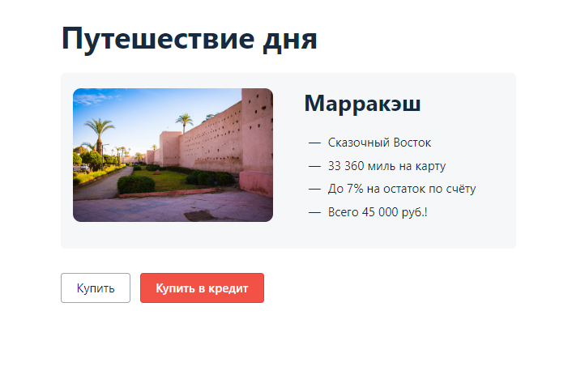

#    План автоматизации
## Перечень автоматизируемых сценариев:
_Предусловие:_ Открыта приложение сервис покупки тура по 2 размым методам по адресу http://localhost:8080 и нажать на выбранный метод оплаты.

## Позитивные сценарии:
1. Успешная оплата тура "Путешествие дня" при валидном заполнение полей формы "Оплата по карте" по действующей карте Ожидаемый результат: появление сообщения об успешной оплате тура
2. Успешная оплата в кредит тура "Путешествие дня" при валидном заполнение полей формы "Кредит по данным карты" по действующей карте Ожидаемый результат: появление сообщения об успешном взятии кредита
3. Отказ в оплате тура "Путешествие дня" при валидном заполнение полей формы "Оплата по карте" по declined карте Ожидаемый результат: появление сообщения об отказе в оплате тура
4. Отказ в кредите на покупку тура "Путешествие дня" при валидном заполнение полей формы "Кредит по данным карты" по declined карте Ожидаемый результат: появление сообщения об отказе в взятие кредита
5. Заполнение поля "Номер карты" номером действующей карты без пробелов, остальные поля заполнены валидно в форме "Оплата по карте" тура "Путешествие дня" Ожидаемый результат: появление сообщения об успешной оплате тура
6. Заполнение поля "Месяц" значением следующего месяца текущего года, остальные поля заполнены валидно в форме "Оплата по карте" тура "Путешествие дня" Ожидаемый результат: появление сообщения об успешной оплате тура
7. Заполнение поля "Владелец" валидными данными с дефисом, остальные поля заполнены валидно в форме "Оплата по карте" тура "Путешествие дня" Ожидаемый результат: появление сообщения об успешной оплате тура
## Негативные сценарии.
1. Оставить поле "Номер карты" пустым, остальные поля заполнены валидно в форме "Оплата по карте" тура "Путешествие дня" Ожидаемый результат: под полем "Номер карты" появиться предупреждение об пустом поле
2. Заполнение поля "Номер карты" 15ю цифрами, остальные поля заполнены валидно в форме "Оплата по карте" тура "Путешествие дня" Ожидаемый результат: под полем "Номер карты" появиться предупреждение о недопустимой длине поля
3. Заполнение поля "Номер карты" 17ю цифрами, остальные поля заполнены валидно в форме "Оплата по карте" тура "Путешествие дня" Ожидаемый результат: под полем "Номер карты" появиться предупреждение о недопустимой длине поля
4. Заполнение поля "Номер карты" 16 рандомными символами, остальные поля заполнены валидно в форме "Оплата по карте" тура "Путешествие дня" Ожидаемый результат: под полем "Номер карты" появиться предупреждение об недопустимых символах
5. Оставить поле "Месяц" пустым, остальные поля заполнены валидно в форме "Оплата по карте" тура "Путешествие дня" Ожидаемый результат: под полем "Месяц" появиться предупреждение об пустом поле
6. Заполнение поля "Месяц" предыдущим месяцем текущего года, остальные поля заполнены валидно в форме "Оплата по карте" тура "Путешествие дня" Ожидаемый результат: автодополнение нулем вначале в поле "Месяц"
7. Заполнение поля "Месяц" 3 цифрами, остальные поля заполнены валидно в форме "Оплата по карте" тура "Путешествие дня" Ожидаемый результат: появится сообщение об ошибке заполнения поля Месяц
8. Заполнение поля "Месяц" значением 00, остальные поля заполнены валидно в форме "Оплата по карте" тура "Путешествие дня" Ожидаемый результат: появится сообщение об ошибке заполнения поля Месяц
9. Заполнение поля "Месяц" значением 13, остальные поля заполнены валидно* в форме "Оплата по карте" тура "Путешествие дня" Ожидаемый результат: появится сообщение об ошибке заполнения поля Месяц
10. Оставить поле "Год" пустым, остальные поля заполнены валидно в форме "Оплата по карте" тура "Путешествие дня" Ожидаемый результат: появится сообщение об ошибке заполнения поля Год
11. Заполнение поля "Год" предыдущим годом, остальные поля заполнены валидно в форме "Оплата по карте" тура "Путешествие дня" Ожидаемый результат: появится сообщение об ошибке заполнения поля Год
12. Заполнить поле "Год" значениями 00 остальные поля заполнены валидно в форме "Оплата по карте" тура "Путешествие дня" Ожидаемый результат: появится сообщение об ошибке заполнения поля Год
13. Осавить поле "Владелец" пустым, остальные поля заполнены валидно в форме "Оплата по карте" тура "Путешествие дня" Ожидаемый результат: под полем "Владелец" появиться предупреждение об пустом поле
14. Заполнение поля "Владелец" кириллицей, остальные поля заполнены валидно в форме "Оплата по карте" тура "Путешествие дня" Ожидаемый результат: появится сообщение об ошибке заполнения поля "Владелец"
15. Заполнение поля "Владелец" спецсимволами, остальные поля заполнены валидно в форме "Оплата по карте" тура "Путешествие дня" Ожидаемый результат: появится сообщение об ошибке заполнения поля "Владелец"
16. Оставление поля "CVC/CVV" пустым, остальные поля заполнены валидно в форме "Оплата по карте" тура "Путешествие дня" Ожидаемый результат: под полем "CVC/CVV" появиться предупреждение об пустом поле
## Перечень используемых инструментов с обоснованием их выбора:
1. IDEA: Intellij IDEA.
2. Язык программирования: Java.
3. Система сборки: Gradle _( проще настраивать, подключать зависимости и плагины )_.
4. Тестовая среда: Junit _( удобен в использовании )_.
5. Фреймворк для UI тестирования: Selenide _( удобный инструмент для тестирования веб-интерфейса )_.
6. Фреймворки для управления данными: Java Faker _( для генерации данных )_.
7. Система репортинга: Allure _( генерирует визуально понятные отчеты )_.
8. Система управлений версий _( простой и популярный )_.
9. Система контейнеризации: Docker _(удобный, нужен для имитации работы IT-системы и запуска приложения через Node.js.)_.
10. Инструмент для тестирования API: Postman _(понятен,удобен)_
## Перечень и описание возможных рисков при автоматизации:
1. Потеря актуальности тестов при изменении UI сайта.
2. Большое количество багов.
3. Усложненное написание автотестов, при отсутствии уникальных сss- селекторов.
## Интервальная оценка с учетом рисков (в часах):
1. Настройка тестового окружения: 6.
2. Составление тест плана по автоматизации тестирования: 4
3. Написание готового кода с автотестами: 40-60.
4. Отладка автотестов и заведение баг-репортов: 10.
5. Подготовка отчета по итогам автоматизированного тестирования – 10
6. Подготовка отчета по итогам автоматизации - 6
##  План сдачи работ:
25.12.2023 _(будут готовы автотесты, результаты их прогона)_.