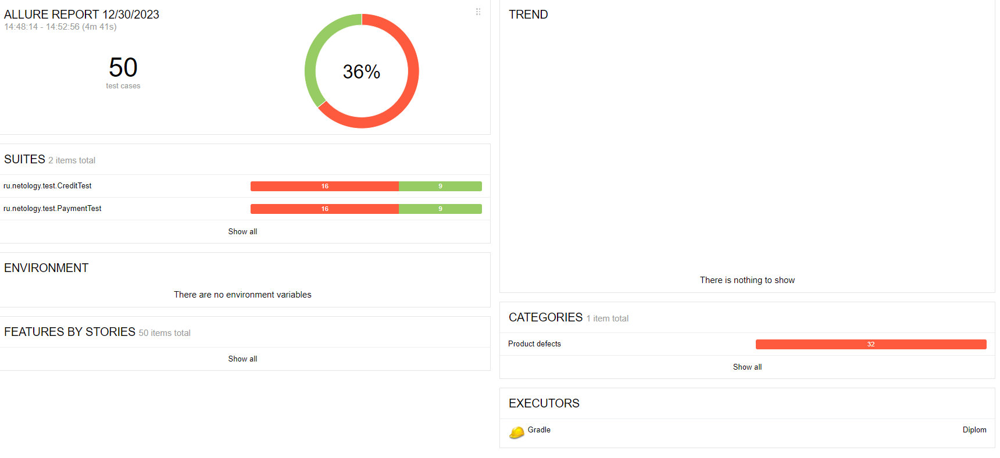

# Отчет о проведенном тестировании
## Краткое описание
В соответствии с тест планом было проведено автоматизированное тестирование приложения
"Путешествие дня". Общее количество проведенных тестов - 50.
## Количество тест - кейсов
Общее количество тест кейсов 50
* Общий процент успешных 36%.
* Покупка дебетовой картой - 25, из них 9 успешеных, 16 неуспешных.
* Покупка в кредит - 25, из них 9 успешных, 16 неуспешных.

## Общие рекомендации
1. Устранить найденные ошибки.
2. Добавить в код страницы специально подготовленные CSS атрибуты для тестирования.
3. Поработать над технической документацией приложения.